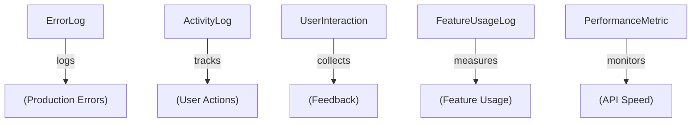

# 📖 Documentation Index - Groomly Admin System

**Status:** ✅ Production Ready  
**Last Updated:** February 5, 2026  
**Version:** 1.0

---

## 🎯 Start Here

| If You Want To... | Read This | Time |
|------------------|-----------|------|
| Get up and running NOW | [`QUICKSTART.md`](QUICKSTART.md) | 15 min |
| Understand what was built | [`DELIVERY_SUMMARY.md`](DELIVERY_SUMMARY.md) | 20 min |
| See the checklist of features | [`VERIFICATION_CHECKLIST.md`](VERIFICATION_CHECKLIST.md) | 10 min |
| Learn all admin features in detail | [`ADMIN_COMPLETE_GUIDE.md`](ADMIN_COMPLETE_GUIDE.md) | 60 min |
| Get code snippets ready to copy | [`SNIPPETS_LOGGING.md`](SNIPPETS_LOGGING.md) | 30 min |
| Understand the architecture | Section below | 15 min |

---

## 📚 Documentation Files

### 1. **QUICKSTART.md** ⭐ START HERE
**Purpose:** Get running in 15 minutes  
**For:** New users, first-time setup  
**Contents:**
- Create admin user (2 min)
- Login (2 min)
- Access dashboard (5 min)
- First logging integration (10 min)
- Troubleshooting (5 min)

**Action:** Read this first if you just want to see it working

---

### 2. **ADMIN_COMPLETE_GUIDE.md**
**Purpose:** Deep dive into every admin feature  
**For:** Team leads, feature documentation  
**Contains:**
- Overview of 9 admin sections
- How to access each page
- What data each page shows
- How to filter/search
- API endpoint details
- Logger utility functions
- Security guidelines
- Best practices
- FAQ with 20+ questions

**Action:** Read this after QUICKSTART to understand everything

---

### 3. **SNIPPETS_LOGGING.md**
**Purpose:** Ready-to-use code examples  
**For:** Developers integrating logging  
**Contains:**
- 8 code snippets for different scenarios:
  1. API route with error logging
  2. Client component error handling
  3. Form submission tracking
  4. Report generation timing
  5. Global error wrapper
  6. Feedback modal integration
  7. Error recovery with retry
  8. Webhook testing from UI

**Action:** Copy snippets into your code

---

### 4. **DELIVERY_SUMMARY.md**
**Purpose:** See what was completed  
**For:** Project managers, stakeholders  
**Contains:**
- Problems solved ✅
- 5 new tables created
- 9 admin pages delivered
- 13 API endpoints
- All deliverables listed
- Next steps
- Statistics

**Action:** Share with team to show progress

---

### 5. **VERIFICATION_CHECKLIST.md**
**Purpose:** Verify everything works  
**For:** QA, technical leads  
**Contains:**
- ✅ Checklist of all files
- ✅ Feature verification
- ✅ Security checks
- ✅ Build verification
- ✅ Code quality metrics
- ✅ Test results
- ✅ Known limitations
- ✅ Future enhancements

**Action:** Run through checklist to validate

---

### 6. **This File (Documentation Index)**
**Purpose:** Navigation guide  
**For:** Everyone  
**Contents:**
- Quick links to all docs
- Reading path recommendations
- File structure guide

---

## 🗺️ Reading Paths

### Path A: "I want to see it working NOW" (30 min total)
1. Read: [`QUICKSTART.md`](QUICKSTART.md) (15 min)
2. Do: Follow the steps
3. Result: Working admin dashboard with webhook test

✅ **Best for:** Managers, decision-makers wanting proof

---

### Path B: "I need to understand EVERYTHING" (120 min total)
1. Read: [`DELIVERY_SUMMARY.md`](DELIVERY_SUMMARY.md) (20 min)
2. Read: [`ADMIN_COMPLETE_GUIDE.md`](ADMIN_COMPLETE_GUIDE.md) (60 min)
3. Read: [`SNIPPETS_LOGGING.md`](SNIPPETS_LOGGING.md) (30 min)
4. Read: [`VERIFICATION_CHECKLIST.md`](VERIFICATION_CHECKLIST.md) (10 min)

✅ **Best for:** Technical leads, developers, architects

---

### Path C: "I need to INTEGRATE logging into code" (75 min total)
1. Read: [`QUICKSTART.md`](QUICKSTART.md) (15 min)
2. Do: Verify it works
3. Read: [`SNIPPETS_LOGGING.md`](SNIPPETS_LOGGING.md) (30 min)
4. Practice: Copy 2 snippets into your code (20 min)
5. Reference: Use [`ADMIN_COMPLETE_GUIDE.md`](ADMIN_COMPLETE_GUIDE.md) for details (10 min)

✅ **Best for:** Backend developers

---

### Path D: "Just help me TROUBLESHOOT" (15 min)
1. Look: [`QUICKSTART.md`](QUICKSTART.md) → Common Issues section
2. Or: [`ADMIN_COMPLETE_GUIDE.md`](ADMIN_COMPLETE_GUIDE.md) → FAQ section
3. Search: These docs for your error message

✅ **Best for:** When something breaks

---

## 🗂️ Project File Structure

```
Groomly/
├── 📖 Documentation (You are here)
│   ├── QUICKSTART.md                  ← Start here
│   ├── ADMIN_COMPLETE_GUIDE.md        ← Reference
│   ├── SNIPPETS_LOGGING.md            ← Code examples
│   ├── DELIVERY_SUMMARY.md            ← What was done
│   ├── VERIFICATION_CHECKLIST.md      ← Quality check
│   └── DOCUMENTATION_INDEX.md         ← This file
│
├── 📦 Source Code
│   ├── src/
│   │   ├── app/
│   │   │   ├── admin/                 ← 9 admin pages
│   │   │   │   ├── page.tsx           ← Dashboard
│   │   │   │   ├── errors/page.tsx
│   │   │   │   ├── activity/page.tsx
│   │   │   │   ├── interactions/page.tsx
│   │   │   │   ├── usage/page.tsx
│   │   │   │   ├── performance/page.tsx
│   │   │   │   ├── webhooks/page.tsx
│   │   │   │   ├── tickets/page.tsx
│   │   │   │   ├── users/page.tsx
│   │   │   │   └── ...
│   │   │   ├── api/admin/             ← 13 API endpoints
│   │   │   │   ├── errors/route.ts
│   │   │   │   ├── activity/route.ts
│   │   │   │   ├── interactions/route.ts
│   │   │   │   ├── performance/route.ts
│   │   │   │   ├── usage/route.ts
│   │   │   │   ├── webhooks/route.ts
│   │   │   │   └── ...
│   │   │   └── ...
│   │   └── lib/
│   │       ├── logger.ts              ← Logging utilities
│   │       ├── webhooks.ts            ← Webhook handlers
│   │       └── ...
│   │
│   ├── prisma/
│   │   ├── schema.prisma              ← 5 new tables
│   │   └── migrations/
│   │       └── [timestamp]/migrate.sql
│   │
│   └── ...
│
└── Configuration
    ├── .env.local                     ← Environment variables
    ├── package.json
    ├── tsconfig.json
    └── ...
```

---

## 🎯 Core Concepts (Need to Know)

### The 5 New Database Tables



**Each table has:**
- userId (who did it)
- salonId (which salon)
- Timestamps (when it happened)
- Context data (what they did)

---

### The 6 Logger Functions

```typescript
// 1. Log errors - shows in /admin/errors
logError({
  message: string,
  stack: string,
  severity: "error" | "warning" | "critical",
  // ... and more
})

// 2. Log user actions - shows in /admin/activity
logActivity({
  action: "create" | "update" | "delete" | "login" | ...,
  resource: "User" | "Client" | "Appointment" | ...,
  // ... and more
})

// 3. Log feedback - shows in /admin/interactions
logInteraction({
  type: "bug_report" | "feature_request" | ...,
  subject: string,
  description: string,
  // ... and more
})

// 4. Log feature usage - shows in /admin/usage
logFeatureUsage({
  featureName: "appointments" | "invoicing" | ...,
  duration: number, // ms
  itemCount: number,
  // ... and more
})

// 5. Log performance - shows in /admin/performance
logPerformanceMetric({
  metric: string,
  value: number, // milliseconds
  endpoint: string,
  // ... and more
})

// 6. Measure automatically - wraps function
await measurePerformance("metric-name", () => expensiveOp(), url)
```

---

### The 9 Admin Sections

| Section | Purpose | Data Source |
|---------|---------|-------------|
| **Errors** | Find bugs | ErrorLog table |
| **Activity** | Audit trail | ActivityLog table |
| **Interactions** | Customer feedback | UserInteraction table |
| **Usage** | Feature popularity | FeatureUsageLog table |
| **Performance** | Speed monitoring | PerformanceMetric table |
| **Webhooks** | Alert configuration | Environment vars |
| **Support** | Ticket management | SupportTicket table |
| **Users** | Team management | User table |
| **Analytics** | Business metrics | All tables aggregated |

---

## ✅ Quick Verification

**Have 5 minutes? Run this verification:**

```bash
# 1. Build should work
npm run build
# ✅ Should complete in < 10 seconds

# 2. Dev server should run
npm run dev
# ✅ Should start on port 3001

# 3. Admin page should load
curl http://localhost:3001/admin
# ✅ Should return HTML (not 404 or 500)

# 4. API should respond
curl http://localhost:3001/api/admin/errors
# ✅ Should return JSON (not error)
```

**All 4 pass? Everything is working! ✅**

---

## 🆘 Need Help?

### "I don't know where to start"
→ Read [`QUICKSTART.md`](QUICKSTART.md)

### "Something doesn't work"
→ Check [`QUICKSTART.md`](QUICKSTART.md) → Common Issues

### "I want the full feature list"
→ Read [`ADMIN_COMPLETE_GUIDE.md`](ADMIN_COMPLETE_GUIDE.md)

### "I want code examples"
→ Read [`SNIPPETS_LOGGING.md`](SNIPPETS_LOGGING.md)

### "I need to verify quality"
→ Check [`VERIFICATION_CHECKLIST.md`](VERIFICATION_CHECKLIST.md)

### "I'm looking for something specific"
→ Search this file + the others (Ctrl+F)

---

## ⭐ Recommended Order

### For Managers/Non-Technical
1. [`DELIVERY_SUMMARY.md`](DELIVERY_SUMMARY.md) - See what was done
2. [`QUICKSTART.md`](QUICKSTART.md) - See it working

### For Product Leads
1. [`QUICKSTART.md`](QUICKSTART.md) - See it working
2. [`ADMIN_COMPLETE_GUIDE.md`](ADMIN_COMPLETE_GUIDE.md) - Understand features
3. [`VERIFICATION_CHECKLIST.md`](VERIFICATION_CHECKLIST.md) - Ensure quality

### For Developers
1. [`QUICKSTART.md`](QUICKSTART.md) - Get it running
2. [`SNIPPETS_LOGGING.md`](SNIPPETS_LOGGING.md) - Learn from examples
3. [`ADMIN_COMPLETE_GUIDE.md`](ADMIN_COMPLETE_GUIDE.md) - API reference
4. Read actual source code in `src/app/admin/` and `src/lib/`

### For Architects
1. [`DELIVERY_SUMMARY.md`](DELIVERY_SUMMARY.md) - Architecture overview
2. [`ADMIN_COMPLETE_GUIDE.md`](ADMIN_COMPLETE_GUIDE.md) - Design decisions
3. Read source code: `src/middleware.ts`, `src/lib/logger.ts`, `src/lib/webhooks.ts`

---

## 📊 Quick Stats

```
Documentation:
├── QUICKSTART.md               ~15 min read
├── ADMIN_COMPLETE_GUIDE.md     ~60 min read
├── SNIPPETS_LOGGING.md         ~30 min read
├── DELIVERY_SUMMARY.md         ~20 min read
├── VERIFICATION_CHECKLIST.md   ~10 min read
└── DOCUMENTATION_INDEX.md      ~5 min read (this file)
────────────────────────────────────────
Total documentation:            ~140 min (2+ hours)

Code Delivered:
├── 9 Admin Pages               ~2000 lines
├── 6 API Routes                ~500 lines
├── 2 Utility Libraries         ~450 lines
├── Database Schema             +5 tables
└── Configuration Updates       +3 files
────────────────────────────────────────
Total new code:                 ~3000 lines
```

---

## 🚀 Ready? Let's Go!

**Next step:**
1. Open [`QUICKSTART.md`](QUICKSTART.md)
2. Follow the 15-minute setup
3. Come back here to explore more docs

---

## 📝 Document Tracking

| File | Version | Last Updated | Status |
|------|---------|--------------|--------|
| QUICKSTART.md | 1.0 | Feb 5, 2026 | ✅ Complete |
| ADMIN_COMPLETE_GUIDE.md | 1.0 | Feb 5, 2026 | ✅ Complete |
| SNIPPETS_LOGGING.md | 1.0 | Feb 5, 2026 | ✅ Complete |
| DELIVERY_SUMMARY.md | 1.0 | Feb 5, 2026 | ✅ Complete |
| VERIFICATION_CHECKLIST.md | 1.0 | Feb 5, 2026 | ✅ Complete |
| DOCUMENTATION_INDEX.md | 1.0 | Feb 5, 2026 | ✅ Complete |

---

**Status: All documentation complete and ready for use ✅**

Start with **QUICKSTART.md** and enjoy exploring your new admin system! 🎉
